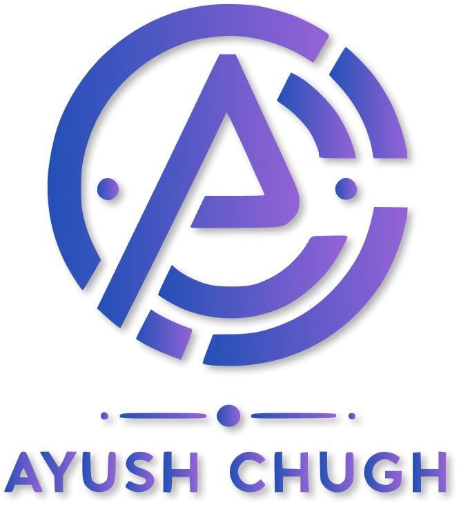

Hi My name is Ayush Chugh
===================================================================================================================================

Passionate Full Stack developer from India. On way to master Programming.

## About Me

Hello! I am a Full Stack Web Developer from Mohali, India, driven by a passion for creating cutting-edge and user-centric digital solutions. My professional journey is adorned with diverse projects that reflect my expertise and innovative thinking.

Leadership and Community Involvement:

As Team Lead at the Innovation Club of CCET College, I have cultivated leadership skills and fostered a collaborative, innovative environment.
I contribute as an assistant in ICT training sessions at my college, aiding in the technological development of government employees.
Organizing the Talent Hunt cultural program has honed my event management skills.
As a student coordinator, I work on the Jhalak (Digital newsletter of CCET, Diploma Wing)

Personal Interests:
Outside of my professional life, I enjoy playing the guitar, which provides a creative and refreshing break from technology.

I am committed to blending technical expertise with creativity in every project, ensuring functional, engaging, and user-centric outcomes. I look forward to embracing new challenges and opportunities in the ever-evolving field of web development.

 ✉️  You can contact me at [biz@ayushchugh.me](mailto:biz@ayushchugh.me)
  
 🚀  I'm currently working on MyCCET (An internal management website for CCET Diploma Wing)
  
 🤝  I'm open to collaborating on MERN projects
  

 

### Skills

  
  
  
  
  
  
  

### Socials

 

# Blog posts

<!-- BLOG-POST-LIST:START -->
- [How to start your journey as a web developer](https://medium.com/@ayushchugh2006/how-to-start-your-journey-as-web-developer-3c30208a6af4?source=rss-6cfed5c2abf1------2)
- [How I started my journey in web development as 13 year old](https://medium.com/@ayushchugh2006/how-i-started-my-journey-in-web-development-as-13-year-old-b18f838af665?source=rss-6cfed5c2abf1------2)
<!-- BLOG-POST-LIST:END -->

### GitHub Stats

  

    
    
  
  

